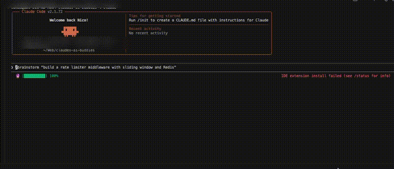

<div align="center">


[](LICENSE)
[](#-testing)
[](https://github.com/cukas/claude-plugins)

*Three AI engines. One codebase. They compete, you ship.*

</div>

---

## Quick Start

```bash
# 1. Install the engines you want (one or both)
npm install -g @openai/codex        # OpenAI Codex
npm install -g @google/gemini-cli   # Google Gemini

# 2. Authenticate
codex auth login                    # uses your OpenAI account
gemini auth login                   # uses your Google account

# 3. Add the marketplace & install
claude plugin marketplace add cukas/claudes-ai-buddies
claude plugin install claudes-ai-buddies@cukas

# Done — start a new Claude Code session
```

> Works with just Codex, just Gemini, or both. Install only what you need.

---

## All Skills

| Command | What it does |
|---------|-------------|
| `/brainstorm "task"` | Confidence bid — three AIs assess the task, you pick who builds it |
| `/forge "task" --fitness "cmd"` | Three-way build competition with automated scoring |
| `/codex "prompt"` | Ask Codex anything — delegate, brainstorm, second opinion |
| `/gemini "prompt"` | Ask Gemini anything — different model, different perspective |
| `/codex-review` | Code review via Codex (uncommitted, branch, or commit) |
| `/gemini-review` | Code review via Gemini (uncommitted, branch, or commit) |
| `/buddy-help` | Full reference, config, troubleshooting |

---

## Brainstorm — Confidence Bid



```
/brainstorm "Fix the race condition in the WebSocket reconnection handler"
```

Each engine assesses the task, rates their confidence, and proposes an approach. Claude calibrates the scores and recommends who should take it.

```
| | Claude (Anthropic) | Codex (OpenAI) | Gemini (Google) |
|---|---|---|---|
| Confidence | 85% | 70% | 60% |
| Approach | Trace reconnect flow, | Add mutex lock on | Use exponential backoff |
|           | find state leak       | shared connection  | with jitter            |
| Risks | Might miss edge case | Could deadlock if | Doesn't fix root cause, |
|       | in retry logic       | not scoped right  | just masks it          |

Recommendation: Claude — highest confidence, already knows the codebase
```

- **Three training sets catch blind spots** — disagreements are the most valuable signal
- **Other engines burn their tokens, not yours** — heavy thinking offloaded to Codex/Gemini
- **Claude calibrates the bids** — adjusts inflated/deflated scores based on approach quality

---

## Forge — Competitive Build

```
/forge "Add input validation to math utils" --fitness "npm test"
```

Three engines independently implement the same task in isolated git worktrees. A staged pipeline scores them objectively — the best code wins.

```
## Forge Scoreboard

| | Claude | Codex | Gemini |
|---|---|---|---|
| Fitness | FAIL | PASS | PASS |
| Score | 0/100 | 82/100 | 89/100 |
| Duration | 4s | 12s | 8s |
| Lint warnings | 2 | 0 | 0 |

Winner: Gemini — score 89/100.
```

- **Staged pipeline** — starter runs first; challengers only if needed; synthesis on close calls
- **Composite scoring** — diff size, lint, style, test pass, duration = objective 0-100 score
- **Speculative tests** — omit `--fitness` and engines propose test suites
- **`--async`** — run in background, continue your conversation
- **Graceful degradation** — works with 3, 2, or 1 engine

<details>
<summary><strong>How Forge works under the hood</strong></summary>

1. **Context** — detects languages, conventions, and candidate files from the task
2. **Stage 1: Starter** — one engine runs first. Auto-accepted if score >= 88 with clean lint
3. **Stage 2: Challengers** — remaining engines run in parallel if the starter didn't clear the bar
4. **Stage 3: Synthesis** — on close calls (spread < 8 pts), losers send critique hunks. Winner refines selectively
5. **Scoreboard** — composite scores (diff 30%, lint 15%, style 15%, files 10%, duration 5%, tests 25%)
6. **Converge** — you approve the winning diff before it touches your working tree

**What to forge:** Algorithms, scoring logic, race conditions, performance-critical code — anything where three perspectives beat one.

**What NOT to forge:** Types, imports, config, UI layout — things with one obvious answer.

</details>

---

## Direct Access & Code Reviews

**Ask anything:**
```
/codex "What's the best way to implement a rate limiter in Go?"
/gemini "Debug this: TypeError: Cannot read property 'map' of undefined"
```

**Code reviews:**
```
/codex-review                                          # review uncommitted changes
/gemini-review                                         # review uncommitted changes
/codex-review branch:main "focus on security"          # review branch diff with focus
```

---

## Using Forge in Your Planning Workflow

`/forge` plugs into your existing workflow (`/build-guard`, plan mode, or any task list). Tag tricky tasks with `[forge]`:

```
## Plan: Add retry logic to sidecar connection

1. Add RetryConfig type to shared types
2. [forge] Implement exponential backoff with jitter algorithm
3. Wire retry config into python-manager.ts
4. [forge] Add circuit breaker pattern for repeated failures
5. Add retry status to UI connection indicator
```

Claude handles the straightforward tasks directly. `[forge]` tasks trigger three-way competition.

---

## Configuration

Optional — works out of the box. Config at `~/.claudes-ai-buddies/config.json`:

| Key | Default | Description |
|-----|---------|-------------|
| `codex_model` | *CLI default* | Codex model override |
| `gemini_model` | *CLI default* | Gemini model override |
| `timeout` | `120` | Max seconds per call (forge uses 600s) |
| `sandbox` | `full-auto` | `full-auto` or `suggest` |
| `debug` | `false` | Enable debug logging |

---

## How It Works

```
┌──────────┐     ┌──────────────┐     ┌─────────────┐     ┌──────────────┐
│   User   │────>│  Claude Code  │────>│  Wrapper.sh  │────>│  Peer AI CLI  │
│          │     │  (orchestrator│     │  (timeout,   │     │  (codex exec  │
│          │<────│   + judge)    │<────│   capture)   │<────│   gemini -p)  │
└──────────┘     └──────────────┘     └─────────────┘     └──────────────┘
```

- **No MCP servers** — direct CLI subprocess calls
- **No API keys in transit** — each engine uses its own auth
- **Parallel execution** — engines run simultaneously
- **Timeout-safe** — safety cap, engines self-exit when done

---

## Testing

```bash
bash tests/run-tests.sh
```

```
=== claudes-ai-buddies test suite ===
  ...
=== Results: 140/140 passed, 0 failed ===
```

---

## Part of the cukas Plugin Ecosystem

| Plugin | Description |
|--------|-------------|
| [**Remembrall**](https://github.com/cukas/remembrall) | Never lose work to context limits |
| [**Patrol**](https://github.com/cukas/patrol) | ESLint for Claude Code |
| **AI Buddies** | You are here |

All available via the [claude-plugins](https://github.com/cukas/claude-plugins) monorepo.

---

MIT License
